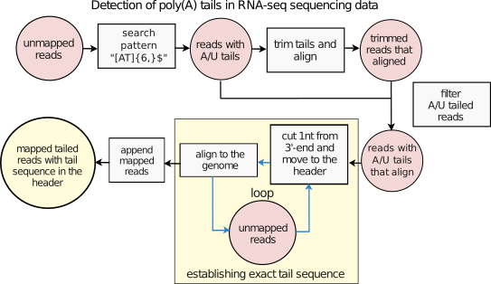

# PyPAD (Python PolyA Detector)

## Detection of polyadenylation in RNA-seq data

Polyadenylation plays a crucial role in transcript maturation, and it is widespread in eukaryotic mRNA. We designed the **PyPAD** - a command-line tool that detects polyadenylation in the available RNA-seq sequencing data sets. 
There are methods for detecting polyadenylation sites based on sequencing of the very end tail of mRNA molecules (TAILseq) and methods requiring available sequencing data. A novelty in our approach is to receive complete information about the structure of polyA tails in all tailed reads. The tool combined Python script with commonly used genomic tools (Hisat2, samtools, bamtools, etc.). We assumed that there were transcripts in the RNAseq data that would not map to the genome due to the presence of a polyA tail. We have extracted reads that have a polyA tail from the unmapped reads. Then, we have cut nucleotides at the 3 ' end of the RNA one by one and remapped reads to obtain a pool of reads having polyA tails. 

## Simplified scheme of PyPAD



## Table of content
* Requirenments
* Usage
* Authors
* Founding


## Requirenements
* Python v 3.x.x
  * [filecmp](https://docs.python.org/3/library/filecmp.html)
  * [re](https://docs.python.org/3/library/re.html)
  * [csv](https://docs.python.org/3/library/csv.html)
* [Biopython](https://biopython.org/wiki/Download)
* [HiSat2](http://daehwankimlab.github.io/hisat2/manual/)
* [samtools](http://www.htslib.org/doc/samtools.html)
* [bedtools](https://bedtools.readthedocs.io/en/latest/)


## Usage
To run PyPAD, please save PyPAD.py in your local directory where you have fastq file to analyse. In the directory, you should prepare folder 'reference' containing built index for HiSat2. (Feel free to use another aligner. To do it, you should change the code in PyPAD.py carefully.)
* Build Hisat2 index according to [documentation](http://daehwankimlab.github.io/hisat2/manual/), and save your reference in "reference" file
* Select unmapped reads -- we recommend to preprocessed data in a common way (quality control, trimming adaptors), and than do alignment, and select unmapped reads. We did it using samtools:
```bash
$  samtools view -b -f 4 input.bam > output_unmapped.bam
```

* Run the code:
```bash
$  python PyPolyADetector.py [optional arguments]
```
* Help & Options
```bash
usage: PyPolyADetector.py [-h] [--strandness {forward,reverse}]
                          [--selectminNnucteotides SELECTMINNNUCTEOTIDES]
                          [--mintail {re.compile'[AT]{6,}$'),re.compile('^[AT]{6,}')}]
                          [--pattern_loop {re.compile('[AT]{1}$'),re.compile('^[AT]{1}'),re.compile('[A]{1}$'),re.compile('^[A]{1}'}]
                          [--infile_path INFILE_PATH]
                          [--outfile_path OUTFILE_PATH]

Welcome to PyPAD - a tool that detects polyadenylation in the available RNA- seq sequencing data. Maintained at https://github.com/igib-rna-tails/PyPAD_PolyA-detector.

optional arguments:
  -h, --help            show this help message and exit
  --strandness {forward,reverse}
                        Forward reads (R1, reading from 5' to 3') or reverse
                        reads (R2, reading from 3' to 5'
  --selectminNnucteotides SELECTMINNNUCTEOTIDES
                        Option in PyPAD to pre-select reads having eg 6 nt in
                        the tail before the proceduce of triming one by one
                        nucleotide from the tail, and realign fastq file.
  --mintail {re.compile('[AT]{6,}$'),re.compile('^[AT]{6,}')}
                        Option of pattern to preselect by
                        --selectminNnucteotides.
  --pattern_loop {re.compile('[AT]{1}$'),re.compile('^[AT]{1}'),re.compile('[A]{1}$'),re.compile('^[A]{1}')}
                        Pattern of nucleotides cut one by one from 3' tail
  --infile_path INFILE_PATH
                        Path to the fastq file with unmapped reads to analyse.
                        Please prepared data before the analysis with PyPAD
  --outfile_path OUTFILE_PATH
                        Path to the output fastq file after PyPAD analysis.
                        The fastq file contains reads with precise polyA tail
                        sequence in the header.
```
## Authors
Lidia Lipińska-Zubrycka, Maciej Grochowski, Michał Małecki (Institute of Genetics and Biotechnology, University of Warsaw, Poland)

## Founding
Work was supported by **Foundation for Polish Science** (grant no. POIR.04.04.00-00-4316/17-00) and **National Science Centre** (grant no. 2019/03/X/NZ2/00787).
